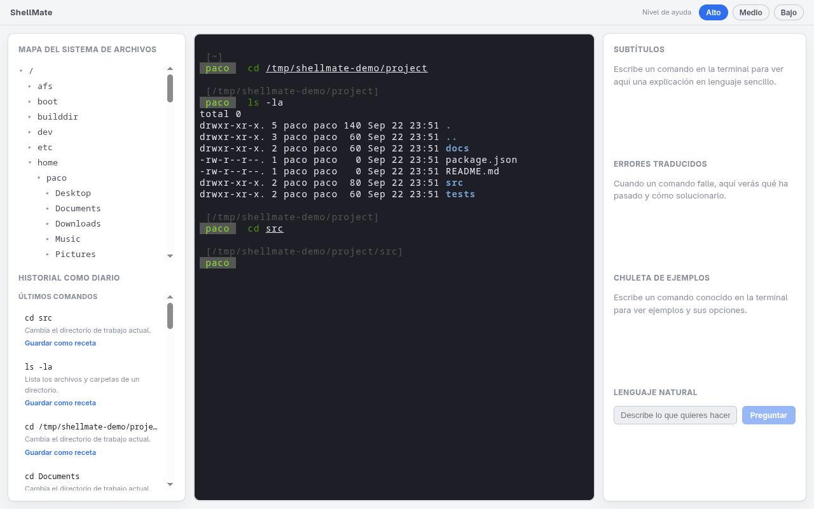
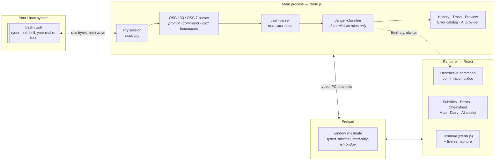

# ShellMate

**A real Linux terminal, surrounded by scaffolding that explains, protects and teaches — and fades away as you learn.**

ShellMate is not a simulated terminal and not a chatbot with a command box bolted on. It runs your actual shell (`bash`/`zsh`, your real aliases, your real `.rc` files) and wraps it in a live danger semaphore, plain-language subtitles, translated errors, a filesystem map, a command diary, and an optional AI copilot — all of which you can dial down, panel by panel, as you stop needing them.

<!--
  Screenshots / GIF placeholders — drop real captures here before publishing.
  Suggested shots: the three-column layout at rest; the semaphore turning
  red mid-keystroke with the destructive-confirmation dialog; the pipeline
  view showing real intermediate output; the help-level slider at "Bajo".
-->




## The problem

A real terminal is the single most powerful tool on a Linux machine, and the single most unforgiving one to learn on: one misread flag and `rm -rf` doesn't ask twice. So beginners either avoid it entirely (and lose the tool), or copy-paste commands from the internet without understanding them (and eventually get burned by one that doesn't do what they assumed).

The usual fixes make one of those trade-offs *permanently*: a simulated/sandboxed terminal is safe but teaches you nothing transferable; a chatbot that writes commands for you never makes you understand what's happening. ShellMate's bet is that the right model is **scaffolding, not a substitute** — full protection and explanation on day one, retired deliberately as the user's own judgment grows, on a terminal that was real the entire time.

## What's built

**Phase 1 — the core loop.** A real pty (`node-pty`) running your actual shell, instrumented via `OSC 133`/`OSC 7` to know prompt/command/cwd boundaries without touching your config. A danger semaphore that colors the input live, from **deterministic rules** (never AI) parsed with `tree-sitter-bash`. Live subtitles breaking a command into plain language. Errors translated from a local catalog. A destructive command blocks `Enter` until you confirm.

**Phase 2 — context and control.** A lazy-loaded filesystem map that follows your `cd` with a "📍 you are here" marker. A command diary with dictionary-derived natural-language labels, and named "recipes" you can re-run later — through the exact same live analysis and confirmation gate as typing by hand. A three-level help slider, wired into every panel, that never touches the safety net itself.

**Phase 3 — the AI layer and the safety net.** An optional natural-language copilot (Gemini by default, Anthropic as a drop-in alternative) whose suggestions are always re-validated by the same local rules before you ever see a danger level. A pipeline view that re-executes a command's stages in the background — *only* when every stage is provably read-only — to show real intermediate output a terminal never exposes. "View as table" for `ls -l`/`ps`/`df`/`du`. And, for `rm`, a preview of exactly what would be affected plus a freedesktop.org-compliant trash with undo, instead of permanent deletion by default.

## How it works



Three processes, one rule: **the main process is the only source of truth.** It owns the pty, the bash parser, the danger classifier, the local data (commands, errors), and the only code that ever calls an AI provider. The renderer never parses a command or decides a danger level on its own — it asks over a fully-typed IPC contract (`shared/ipc-contract.ts`) and renders whatever comes back. That boundary is also why an AI-suggested command is re-classified locally before it's shown: the provider's opinion of its own risk is discarded entirely, it isn't even part of the response type.

The full architecture — folder-by-folder module breakdown, the shell-integration scripts, every IPC channel — is in [`PLAN.md`](./PLAN.md). Every non-obvious engineering decision (and a couple of real bugs found only by running the app for real) is logged as it happened in [`journal/`](./journal), one file per decision.

## Design decisions

**Why the semaphore is rules, not AI.** The one thing this app cannot afford to get wrong, even occasionally, is telling someone a command is safe when it isn't. A language model can be very good at this and still be wrong in a way that's expensive to be wrong about — and a wrong guess here isn't a bad suggestion, it's a false sense of safety right before `Enter`. A ~150-line deterministic classifier can be exhaustively unit tested (it is — see `danger-classifier.test.ts`) and audited by reading it top to bottom. AI only enters the picture one layer removed, for turning a natural-language *request* into a candidate command, and even then its output is re-parsed and re-classified by the same local rules before it's ever shown — see `journal/2026-09-22-ai-provider-abstraction.md`.

**Why help retires instead of staying constant.** The point isn't a terminal that's permanently easier to use — plenty of those exist and don't teach anything transferable. It's a terminal that starts maximally explained and lets *you* decide, panel by panel, when you've outgrown an explanation. That only works if the thing doing the explaining is never the same thing doing the protecting: the danger badge and the destructive-command confirmation are deliberately **not** gated by help level, at any setting — see `journal/2026-09-22-help-level-behavior.md` for the full reasoning. Scaffolding is supposed to come down. A safety net isn't scaffolding.

**Why a real shell, not a simulation.** Everything you learn in ShellMate is exactly what you'd type without it — the same `rm`, the same flags, the same muscle memory — because it *is* your shell, with your aliases and your prompt, not a lookalike. The integration scripts (`shellmate.bash`, `shellmate.zsh`) source your real `.rc` files first and only ever *add* OSC hooks at the end, specifically so the tool disappears the moment you stop needing its help, instead of leaving you having learned a dialect of a terminal that isn't the one you'll actually use.

**Why the AI provider is swappable.** Gemini is the default because that's what this project's own key is, but nothing about the design assumes it. `AiProvider` is a two-method interface; `ai-service.ts` picks an implementation from `AI_PROVIDER` and everything downstream (danger re-validation, help-level gating) is provider-agnostic. Anyone cloning this uses whichever key they already have.

**Why trash instead of permanent delete.** A confirmation dialog stops a *misread* command; it does nothing for a correctly-read command that turns out to be a mistake five minutes later. For `rm` specifically, "move to trash" (the real freedesktop.org spec, with undo) is offered as a co-equal option next to "run it for real" — the safety net catches the case a warning dialog structurally can't.

## Quick start

**Requirements:** Linux, Node.js 22+, and a C/C++ toolchain (`node-pty` compiles a small native addon on install — `sudo dnf install gcc-c++` on Fedora, `sudo apt install build-essential` on Debian/Ubuntu).

```bash
git clone https://github.com/Pacolias/shellmate.git
cd shellmate
npm install
npm run dev
```

To try the natural-language copilot, add a key — either works, Gemini is the default provider:

```bash
cp .env.example .env
# then edit .env and fill in GEMINI_API_KEY (or ANTHROPIC_API_KEY + AI_PROVIDER=anthropic)
```

`.env` is loaded automatically on launch and is gitignored, so the key never gets committed. `export`-ing the variable in your shell before `npm run dev` works too, it just won't persist across terminals. Without either, the app runs exactly the same — that one panel just shows setup instructions instead of failing.

Other useful commands:

```bash
npm test          # 122 unit tests — parser, danger classifier, trash, table parsers, ...
npm run typecheck # strict TypeScript, main + renderer
npm run build     # production build (out/)
```

## Tech stack

| Piece | Choice |
|---|---|
| Shell | Electron 44 |
| UI | React 19 + TypeScript + Vite 7 (via `electron-vite`) |
| Terminal | `xterm.js` + `node-pty` |
| Command parsing | `tree-sitter-bash` via `web-tree-sitter` (WASM) |
| AI | `@google/genai` (default) / `@anthropic-ai/sdk`, behind a shared interface |
| Trash | freedesktop.org Trash spec, home trash |
| Tests | Vitest, 122 tests across parser/classifier/services |
| Data validation | Zod, for the command dictionary and error catalog |

The command dictionary (`data/commands.json`) covers 50 everyday commands with plain-language descriptions, flag explanations and examples; the error catalog (`data/errors.json`) covers 12 common failure patterns — both are plain, versioned JSON, not generated at runtime.

## License

MIT — see [`LICENSE`](./LICENSE).
